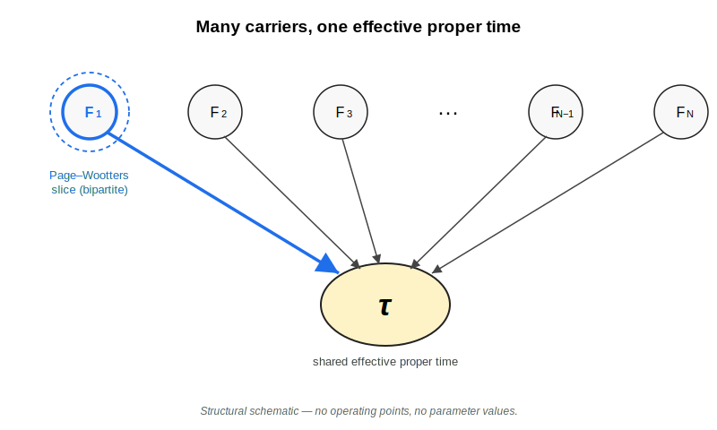

# Harbour View — Temporal Redundancy and Emergent Proper Time

**Document type:** Harbour View. A presentational vantage-point document under Local Stewardship — neither a peer-reviewed publication nor an authoritative version of any of the framework artefacts it presents.
**Version:** v0.1
**Date:** 2026-05-28 (drafting; §1 + §2 only)
**Endorsement Marker:** Local Stewardship (Ulrich Warring, Physikalisches Institut, Albert-Ludwigs-Universität Freiburg). Authority from use, not endorsement; the externally validated physical theories cited below — quantum mechanics, special relativity, and general relativity in its weak-field regime — are referenced only as *constraints* on the framework, not as objects of derivation or as endorsers of the work.
**Lineage:** Coastline v0.4 (*Consensus-Emergence of Classical Proper Time*) + Methodological Note v0.3 (*The Temporal-Redundancy Functional*) + Breakwater Ledger entry CL-2026-006 v0.5 (*Sorci et al. — Quantum Signatures of Proper Time in Optical Ion Clocks*) + the temporal-micro-consensus numerics toolkit at commit `938b0a6`. Presented as a single window onto this body of work; the underlying artefacts remain the authoritative versions of every claim and result reported here.
**Status:** **Pre-pilot-review public draft, §1 and §2 only.** §§3–5 and the reference apparatus are held until the external-independent pilot read required by the artefact-category specification has been received and folded. An open call for that read was issued and closed on 2026-05-28 (see the [closed-call brief](../docs/view-framework-overview-v0.1-pilot-reader-brief.md) for the audit record); the route to satisfying the requirement is now under separate stewardship consideration.
**Primary audience:** Physicists working at the interface of foundations and metrology. The §1 executive overview is intended to be followable by such a reader with no prior familiarity with this project's vocabulary; specialist terms are anchored briefly on first use, and a short glossary appears immediately below.

---

## A note on language, and a short glossary

This document avoids project-internal shorthand where possible. Terms such as *Coastline*, *Methodological Note*, *Breakwater Ledger*, and *Sail* are used only where they identify a specific project artefact; the scientific claim itself is stated in ordinary descriptive language first.

A short glossary follows for the §1 + §2 pilot-reader draft; the full reference apparatus (commented bibliography, Toolkit Provenance, Figure Provenance, Acknowledgements & Conflict-of-Interest, citation metadata) is assembled at the next drafting stage.

- **Harbour View** — this document's artefact category. A presentational, externally-readable, citable document that surveys a body of project work from one declared vantage point; presents adapted content from the underlying notes but is not authoritative over them.
- **Coastline** — a versioned, falsifiable framework proposal under Local Stewardship. The present View is anchored to *Coastline v0.4 — Consensus-Emergence of Classical Proper Time.*
- **Breakwater Ledger** — the project's claim-status classifications: each Ledger entry classifies a specific external proposal (an experimental paper, a theoretical model) as *compatible*, *underdetermined*, or *inconsistent* with the Coastline at a declared version.
- **Methodological Note (MN)** — an instrument-and-measure document defining a specific operational tool used by the framework. The present View is anchored to *MN v0.3 — The Temporal-Redundancy Functional.*
- **Sail** — a commentary or essay document; the project's explanatory-register channel, distinct from the framework artefacts above. Sails are out of scope for the present View.

---

## §1 — Executive overview

**The question.** *Is classical proper time emergent from many microscopic quantum degrees of freedom, and if so, what would it take to demonstrate that it is?* This document reports the current state of a framework that takes the question seriously, and the methodological and numerical work done so far to operationalise it.

**The headline — the transplant.** The framework borrows one structure from **quantum Darwinism** (Zurek 2003, 2009) — the idea that classical behaviour appears when many independent fragments of an environment each carry a redundant record of the same information — and applies it to proper time. The bipartite correlation between a "clock" subsystem and the rest of the world that the **Page–Wootters mechanism** (Page & Wootters 1983) describes is treated as one special case embedded in this wider multipartite-redundancy picture, not as the picture itself.

**The headline — the regime caveat.** That structural transfer has been *made more precise, but not solved*. The framework's principal open problem (discussed in §2) is whether redundant *temporal* records can be exhibited rather than merely assumed: a candidate numerical exemplar exists (Methodological Note v0.3 §8; Breakwater Ledger entry CL-2026-006 v0.5), but only within an assumed regime in which the temporal pointer is taken as *einselected* — already environment-selected, in the Zurek sense. Whether such a temporal pointer can be *derived* rather than assumed is not addressed here. The framework remains a falsifiable proposal; this document presents what is currently known and where the open boundaries are.

**What this document is.** A *Harbour View* is this project's name for an externally-readable, citable presentation of a body of work — a vantage point onto the framework's current state, derived from but not authoritative over the underlying notes. The authoritative versions of every claim, anti-claim, and result live in the cited Coastline, Breakwater Ledger entries, and Methodological Note (see glossary above). No claim, definition, or anti-claim is introduced in this document that is not already on record in those underlying notes; **the View summarises those records, it does not replace them**.

**A vantage point, sketched.**

*Figure 1. The framework, in one schematic. Many microscopic carriers `F_1, F_2, …, F_N` each couple to a single shared effective proper-time variable `τ`. The Page–Wootters case (the special-case configuration with one carrier `F_1` and the proper-time variable `τ`) is drawn highlighted and nested inside the wider many-carrier picture — visually marked by a thicker arrow, a dashed enclosure around the slice, and an explicit "Page–Wootters slice (N = 2)" label. The reading: proper time as a robust collective variable across many carriers, not as a private property of any one of them. The figure carries no operating-point claim — that comes in §3 and §4.*

---

## §2 — Framework

This section presents the framework's current public statement — Coastline v0.4, *Consensus-Emergence of Classical Proper Time* — at the level needed to read the rest of this document. It does not replace the Coastline note: every claim below is restated from there with a section pointer, and every limit and anti-claim is preserved verbatim or by cross-reference. A *Coastline* is the project's term for a versioned, falsifiable framework proposal under Local Stewardship; the present one was first issued at v0.1 in May 2026 and is, at the time of this View, at v0.4.

### What the framework claims

The framework states one specific thesis about classical proper time, decomposed into five published claims (Coastline v0.4, *Novel Boundaries* §§I–V):

- **Claim I — Problem statement.** A classical proper-time variable is *not* assumed to be microscopically sharp. It is treated as an emergent effective variable: a parameter that need not be well-defined at the level of individual quantum degrees of freedom and that acquires operational meaning only at the level of coarse-grained collective records (Coastline v0.4 §I).
- **Claim II — Emergence criterion.** The conditions under which many independent microscopic carriers *jointly* support a single effective proper-time variable are taken to be the temporal analogue of the three Zurek criteria for quantum Darwinism — *redundancy*, *stability*, *compressibility* (Zurek 2003, 2009; Ollivier, Poulin & Zurek 2004, 2005) — applied to the temporal degree of freedom. The framework is explicit that this is a *structural transplant by analogy*, not a derivation: exhibiting a system that satisfies the temporal version of those criteria is the framework's principal open problem (Anti-Claim #6 below; Coastline v0.4 §II, *Status of specialisation*).
- **Claim III — Failure mode.** If the consensus is lost — if independent carriers cease to agree, by the operational measures of Claim IV — then a single classical proper-time variable is no longer well-defined for the system. Falsifiability here depends on a decisive test: distinguishing a genuine loss of temporal consensus from ordinary measurement noise (Coastline v0.4 §III).
- **Claim IV — Operational anchors.** Three measures are registered for evaluating the Claim II criteria: a mutual-information measure `I(C : M)` between a clock register `C` and a macrofragment `M` of the carrier set; a Fisher-information measure `F[τ]` for resolving `τ` against the carriers; and a redundancy measure `R_δ`, the number of disjoint carrier-fragments that each independently carry the temporal record to within a deficit `δ` (Coastline v0.4 §IV).

  Two distinct roles for these measures are also recognised, and the framework explicitly defers a full *measure-registration protocol* — a complete account of which measure plays which role — to a later Coastline version. The distinction is between **resolution anchors** and **classification anchors**. In clock language: a resolution anchor asks how well the carrier set can distinguish nearby values of `τ` at all; a classification anchor asks whether the temporal record is *distributed redundantly*, so that several disjoint carrier-fragments each support the same effective `τ` rather than only the full many-body state doing so (Coastline v0.4 §IV; cross-reference: design note logged in the project's roadmap, 2026-05-26).
- **Claim V — Positioning.** The framework is *not* a new theory of time. The Page–Wootters mechanism (Page & Wootters 1983; modern developments by Mendes & Soares-Pinto 2019 and Smith & Ahmadi 2020) is the canonical proposal for time emerging from quantum correlations between a "clock" subsystem and "the rest" of a closed quantum system; this framework treats the Page–Wootters bipartite case as one channel of temporal information within a wider multipartite-redundancy picture, not as the picture itself. Quantum Darwinism is the canonical proposal for the emergence of classical *configurational* objectivity through redundant proliferation of information into many environmental fragments; this framework specialises that architecture to the *temporal* degree of freedom (Coastline v0.4 §V).

### The seven anti-claims

The Coastline explicitly does *not* claim the following (Coastline v0.4, *Anti-Claims* §§1–7):

1. That "consensus" is a fundamental theory of time emergence. It is a productive interpretive framework subject to operationalisation through the Claim IV measures.
2. That microscopic carriers literally "decide" or exhibit agent-like behaviour. *Consensus*, *agreement*, and *support* are placeholders for the Claim IV operational measures; the term *decision* is stipulatively excluded from the framework's body and is reserved for the explanatory register used in the project's commentary documents (its *Sails*).
3. That the Page–Wootters mechanism or quantum Darwinism are deficient. Both are assumed as background, and the framework specialises their conjunction; it does not seek to correct either.
4. Parity with the established frameworks of the Coastline's *External Constraints* section — quantum mechanics, special relativity, the Page–Wootters mechanism, quantum Darwinism, and general relativity in its weak-field regime. The framework is a proposal for interpretation and design, not a derivation of physical law. (The Coastline's Endorsement-Marker paragraph separately names quantum information theory as constraint-only background; the View uses QIT techniques operationally in §3 and §4 under that same no-parity discipline.)
5. A bridge to any other framework. The framework's sibling-by-name *Causal Clock Unification Framework* (CCUF) is registered as a deferred item; no bridge is committed at v0.4.
6. **That the quantum-Darwinism emergence criteria have been *established* for temporal records.** Claim II transplants criteria proven for *configurational* records onto *temporal* ones by structural analogy. Exhibiting a system that instantiates *redundant temporal* records — as opposed to merely multipartite or entanglement-enhanced ones — is the framework's principal open problem. This anti-claim is the one around which this Harbour View is organised: the methodology presented in §3 and the worked exemplar in §4 are the framework's first quantitative steps toward this open problem, and §§3–4 themselves state explicitly that those steps do *not* discharge it — they operate within an assumed-einselection regime, and Anti-Claim #6 remains open beyond that regime.
7. That the framework applies in **strong-field, non-perturbative, or quantum-gravitational** regimes, or in settings without a well-defined inter-worldline comparison protocol. The framework's scope is the special-relativistic and weak-field (post-Newtonian) regime; extension beyond that requires additional structure not committed at v0.4.

### Multipartite is not redundant

A small terminological point carries forward into §3 and §4 and is worth surfacing here. *Multipartite* states — states with many sub-systems — are *not* the same as *redundant* states. A maximally entangled state of `N` parts is in fact *anti-redundant*: no proper subset of the parts carries on its own the information that the whole carries. Distributed-clock and entanglement-enhanced metrology protocols realise multipartite temporal structures but are typically anti-redundant in precisely this sense; the framework's redundant-consensus condition is a strictly stronger requirement than multipartiteness, and methods that satisfy multipartiteness alone do not satisfy it (Coastline v0.4 §II *Many vs redundant*; §V *Positioning vs distributed-clock metrology*).

### Regime of validity: SR and weak-field GR only

The framework operates within special relativity for the flat-spacetime baseline and within general relativity in its **weak-field (post-Newtonian) regime** for worldlines that may be accelerated or located at differing gravitational potential. Spacetime curvature enters perturbatively, as the leading-order contribution to a *cross-probe residual* that no single proper-time variable reproduces — i.e., as a Claim II.3 incompressible residual and a Claim IV cross-probe-mismatch quantity (Coastline v0.4, *External Constraints* item 5; *Regime of Validity*; *Anti-Claims* §7). Strong-field, non-perturbative, and quantum-gravitational regimes are explicitly out of scope, as are settings in which no shared inter-worldline comparison protocol exists. The framework's relationship to general relativity in this regime is one of *respect, not parity*: GR is used as a constraint on the framework, not derived, extended, or modified by it (per Anti-Claim §4 above). Two specific Breakwater Ledger entries — the project's claim-status classifications against the framework — record the framework's first contact with concrete experimental and theoretical proposals at the regime boundary: CL-2026-007 v0.2 (a bipartite quantum-time-dilation proposal) and CL-2026-008 v0.2 (a class of distributed clock-network proposals). Both are classified *underdetermined* with respect to the framework as currently written and are discussed in §5.

### A vantage point on the geometry

![Schematic 2 — top: the L_source ⊂ L_apparatus ⊂ L_comparison nested hierarchy; bottom: side-by-side contrast of an anti-redundant entanglement-enhanced state (fragments shown with dashed borders and an explicit ✗ R "no record" marker — no proper fragment carries R) versus a redundant consensus state (fragments shown with solid borders and an explicit ✓ R "carries record" marker — many fragments each carry R). Contrast encoded by both colour and shape/line-style/marker so the figure remains legible under colourblindness and in greyscale.](figures/schematic-02-comparison-geometry.svg)

*Figure 2. The framework's structural geometry. Top: the comparison geometry. Each carrier sits in a region of scale `L_source` (the local quantum system itself); the local measurement apparatus operates on the larger scale `L_apparatus`; the inter-worldline-comparison protocol acts on the still-larger scale `L_comparison`. The framework's claims about consensus, robustness, and cross-probe mismatch are statements about quantities at the `L_comparison` scale; this hierarchy locates them. Bottom: the multipartite-versus-redundant contrast. On the left, an entanglement-enhanced state `Ψ_total` whose proper fragments (drawn with dashed borders and an explicit "✗ R" marker) do not individually carry the temporal record `R` — multipartite but anti-redundant. On the right, a redundant consensus state in which many fragments (drawn with solid borders and an explicit "✓ R" marker) each carry `R` — the condition Claim II asks for. The contrast is *structural* — which fragments carry the record — never parametric; it is encoded by both colour and shape/line-style/marker, so the figure remains legible without colour.*

This concludes §2. §3 (methodology) operationalises the Claim II emergence criterion through a specific functional defined on multi-carrier states, and §4 (worked exemplar) is the framework's **first candidate** numerical instance of a redundant *temporal* record **within the assumed-einselection regime** that Anti-Claim #6 names as the open problem — not a resolution of Anti-Claim #6, which remains open beyond that regime. Both follow once §1 and §2 have been read.

---

## §3 — Methodology

*To be drafted at spec §12 next-move 10, after pilot-reader review of §1 + §2 is complete and any resulting structural revisions are folded back into the outline.*

---

## §4 — Worked exemplar

*To be drafted at spec §12 next-move 10.*

---

## §5 — Open problems and invitations to engage

*To be drafted at spec §12 next-move 10.*

---

## Reference apparatus

*To be assembled at the next drafting stage, from the existing **commented-bibliography draft worksheet** ([../docs/view-framework-overview-v0.1-bibliography-draft.md](../docs/view-framework-overview-v0.1-bibliography-draft.md)) — a draft, not the final apparatus — together with the Toolkit Provenance (Block 3) and Figure Provenance (Block 4) subsections recorded in the TOC outline. The Acknowledgements and Conflict-of-Interest block is kept separate from the bibliography, per the project's Q11c discipline; the steward's prior NIST Boulder association with D. Leibfried (a co-author of the Sorci et al. paper at the heart of CL-2026-006) is acknowledged explicitly there, while C. Sanner is explicitly not acknowledged, per the 2026-05-26 logbook correction.*

---

*End of draft. §1 + §2 only. Lock-Key held: Coastline / Methodological Note / Breakwater Ledger / Sail untouched.*
